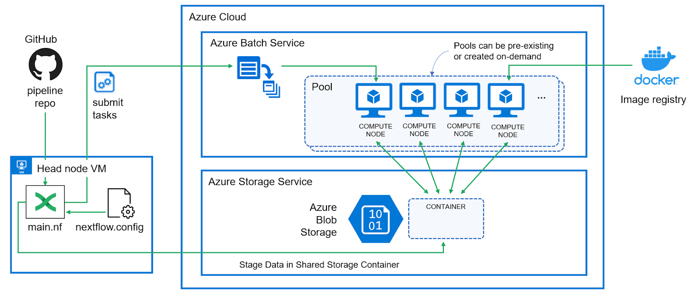

# Execute Nextflow Pipeline with Azure Batch

Nextflow has gained traction due to its ability to separate pipeline logic from the execution environments it runs on. This feature, coupled with its support for a variety of data protocols, source code management systems, container runtimes, and registries, empowers users to swiftly develop pipelines that can be deployed across different computing environments - from personal notebooks to large on-premises clusters and various cloud platforms.

According to the recent State of the [Workflow 2022 Community Survey](https://seqera.io/blog/state-of-the-workflow-2022-results/), 36% of Nextflow users are currently running their pipelines in the cloud, and a significant 68% are planning to transition to cloud-based operations. [Azure Batch](https://learn.microsoft.com/en-us/azure/batch/) stands out as a preferred execution environment among Nextflow users. While the integration of Nextflow with Azure Batch simplifies cloud operations, it’s important to note that there’s a lot happening behind the scenes. Gaining a deeper understanding of this integration can lead to more efficient use of cloud resources and make it easier to troubleshoot potential issues.

In this article, we take a closer look at using Nextflow with Azure Batch and explain how to set it up and how it works under the hood.

## Azure Batch Concepts

Like other modern cloud services, Azure Batch is feature-rich with many configuration options. Below are some terms and concepts that you will need to be familiar with:

**Batch Account** – An Azure Batch Account is a uniquely identified entity within the Batch service. It’s used to create compute resources (pools of compute nodes) and Batch jobs. All processing and resources are associated with a Batch account. When your application makes a request against the Batch service, it authenticates the request using the Azure Batch account name, the URL of the account, and either an access key, or use Microsoft Entra authentication. As with other cloud services, there are limits on certain resources associated with Azure Batch. The Azure Batch documentation has a good explanation of [batch services quotas and limits](https://learn.microsoft.com/en-us/azure/batch/batch-quota-limit). For production scale pipelines, you will likely need to request an increase in quota.

**Storage Account** – Most Batch solutions use Azure Storage for storing resource files and output files. For example, your Batch tasks (including standard tasks, start tasks, job preparation tasks, and job release tasks) typically specify resource files that reside in a storage account. Storage accounts also stores data that is processed and any output data that is generated. A corresponding storage account should be set up and associated with the batch account in the same cloud region for each batch account. For Nextflow, we will set up a container in Blob storage to act as a working directory for pipeline execution.

**Nodes** – In Azure Batch, a node is an Azure virtual machine (VM) dedicated to processing a portion of an application’s workload. The size of a node (specified using a vm_type setting) determines the number of CPU cores, memory capacity, and local disk size allocated to the node.

**Pools** – A pool in Azure Batch refers to a collection of nodes with the same configuration. Multiple named pools can be associated with a batch account, and Azure cloud administrators can specify the type of nodes and images associated with each pool. Pools can be created in advance or created dynamically in response to workload demand. Every node that is added to a pool is assigned a unique name and IP address. When a node is removed from a pool, any changes that are made to the operating system or files are lost, and its name and IP address are released for future use. When a node leaves a pool, its lifetime is over.

**Jobs and tasks** – Unlike traditional workload managers, Azure Batch does not explicitly have the notion of queues, but Azure Batch jobs provide similar functionality. They manage dispatching tasks to pools, implement scheduling policies, auto-scaling resources, managing start tasks, and more. While a job is a collection of tasks, an Azure Batch task defines a unit of work.

## About the Integration

The diagram below illustrates how the Nextflow – Azure Batch integration works. Azure administrators begin by setting up a storage service and a batch environment in the Azure cloud, recording the credentials for both services or setting up Microsoft Entra for authentication. While tasks can be sent to Azure Batch by Nextflow users from a local laptop or PC, we will set up a VM within the Azure cloud to submit jobs in this tutorial.

The Nextflow configuration file is updated with details about the Azure Batch and Storage environments, and users run pipelines as usual. The only difference is that the path to a shared Azure storage container, which serves as a work directory, must be specified on the Nextflow command line.



Nextflow recognizes that the Azure Batch integration is needed when the *azurebatch* executor is specified in the Nextflow configuration file. Nextflow is flexible in this regard and clients can optionally choose to run some process steps in Azure and others locally or in other compute environments.

When Nextflow detects that the azurebatch executor is to be used, Nextflow automatically installs and configures the *nf-azure* plug-in. Source code for the plug-in is available on [GitHub](https://github.com/nextflow-io/nextflow/tree/master/plugins/nf-azure). The plug-in implements all the details associated with interacting with Azure Blob storage and managing resources and task execution in the Azure Batch environment.

Users can either configure the Azure Batch pools in advance or optionally let Nextflow interact with the Azure Batch API to create resources on the fly using specified VM types and virtual machine images.

## Configure Azure Batch Environment

To configure Azure Batch, you can follow the steps below. These instructions assume that you have a Microsoft Azure account and [contributor](https://learn.microsoft.com/en-us/azure/role-based-access-control/built-in-roles#contributor) rights in the Azure subscription you want to work with. Also we will use the [Azure Command-Line Interface (CLI)](https://learn.microsoft.com/en-us/cli/azure/) to configure the Azure resources, and SSH to connect to the head node from which we run our Nextflow pipelines. Lets begin with the definition of some parameters which we will use during the process of setting up the Azure environment:


```bash
#subscriptionName="<insert_subscription_to_use>"

resourceGroupName="rg_nextflowdemo"
region="westeurope"

# between 3 and 24 numbers and lowercase letters only
# must be unique within Azure
storageAccountName="sanextflowdemo"
storageContainerName="nfdemocontainer"

# between 3 and 24 numbers and lowercase letters only
# must be unique within the region
batchAccountName="banextflowdemo"

# Nextflow headnode parameters
vmNFHeadnodeName="vm-nf-headnode"
vmNFHeadnodeImage="Ubuntu2204"
vmNFHeadnodeSKU="Standard_D2as_v5"
vmNFHeadnodeUsername="nfuser"
vmNFHeadnodeSSHKey="~/.ssh/id_rsa.pub"
```

Now lets log in with your Microsoft Azure account and make sure the right subscription is selected:


```bash
#az login --use-device-code
```


```bash
# Set subscription to be used
#az account set --subscription $subscriptionName
```


```bash
# Verify you are in the right subscription
#az account show --query name
```

### Create a Resource Group

Run the following [az group create](https://learn.microsoft.com/en-us/cli/azure/group#az-group-create) command to create an Azure resource group named as defined in *resourceGroupName* in the Azure region defined by *region*. The resource group is a logical container that holds the Azure resources for this tutorial.


```bash
az group create \
    --name $resourceGroupName \
    --location $region
```

### Setup an Azure Storage Account

Use the [az storage account create](https://learn.microsoft.com/en-us/cli/azure/storage/account#az-storage-account-create) command to create an [Azure Storage account](https://learn.microsoft.com/en-us/azure/batch/accounts#azure-storage-accounts) which will be linked to your Batch account and be used as working directory. Run the following command to create a *Standard_LRS SKU* storage account named as defined in *storageAccountName* in the resource group we just created:


```bash
az storage account create \
    --resource-group $resourceGroupName \
    --name $storageAccountName \
    --location $region \
    --sku Standard_LRS
```


```bash
az storage container create \
    --name $storageContainerName \
    --account-name $storageAccountName \
    --auth-mode login
```


```bash
# As Azure storage admin: Get storage account keys to sign the token
storageKey=$(az storage account keys list --resource-group $resourceGroupName --account-name $storageAccountName --query [0].value -o tsv)
```


```bash
# As Azure storage admin: Create SAS token with specified lifetime
expirydate=`date -d '2 hours' '+%Y-%m-%dT%H:%MZ'`
sastoken=$(az storage container generate-sas \
    --name $storageContainerName \
    --account-name $storageAccountName \
    --permissions acdlrw \
    --expiry $expirydate \
    --account-key $storageKey | tr -d '"')
```

### Create a Batch Account

Run the following [az batch account create](https://learn.microsoft.com/en-us/cli/azure/batch/account#az-batch-account-create) command to create a [Batch account](https://learn.microsoft.com/en-us/azure/batch/accounts#batch-accounts) named as defined in *batchAccountName* in your resource group and link it with the storage account you just created:


```bash
az batch account create \
    --name $batchAccountName \
    --storage-account $storageAccountName \
    --resource-group $resourceGroupName \
    --location $region
```


```bash
batchKey=$(az batch account keys list --name $batchAccountName --resource-group $resourceGroupName --query primary -o tsv)
```

## Deploy a VM to run Nextflow

Even if it is not mandatory, it is generally advisable to start pipelines from a virtual machine (VM) in the cloud and not from a personal desktop or laptop. This is particularly beneficial for workflows that have a long runtime. Although this VM does not function exactly like a cluster head node, it serves a similar purpose by coordinating Azure Batch resources and overseeing the submission and management of workflows.

Running pipelines from a VM in the cloud helps reduce data transfer. Users can also conveniently power off their local machines while pipelines are still running, and are protected from temporary network interruptions that could potentially disrupt their workflow.

Now create a virtual machine with the az vm create command and store the IP which will be used later to access the machine:


```bash
az vm create \
    --resource-group "rg_privatebatchdemo" \
    --name $vmNFHeadnodeName \
    --size $vmNFHeadnodeSKU \
    --image $vmNFHeadnodeImage \
    --admin-username $vmNFHeadnodeUsername \
    --ssh-key-values $vmNFHeadnodeSSHKey
```


```bash
vmNFHeadnodeIP=$(az vm show -d -g "rg_privatebatchdemo" -n $vmNFHeadnodeName --query publicIps -o tsv)
```

## Prepare Headnode and Install Nextflow

On the newly provisioned Ubuntu VM, you can do some housekeeping such as updating the apt package index. Download [azcopy](https://learn.microsoft.com/en-us/azure/storage/common/storage-use-azcopy-v10), a command-line tool which we will use to download the results from the Storage Account, and install Java since a JVM is required in order to run Nextflow. After installing Java, verify that it runs by running the java from the command line.


```bash
ssh -o StrictHostKeyChecking=no $vmNFHeadnodeUsername@$vmNFHeadnodeIP \
    'wget https://azcopyvnext.azureedge.net/releases/release-10.23.0-20240129/azcopy_linux_amd64_10.23.0.tar.gz; \
    tar -zxvf azcopy_linux_amd64_10.23.0.tar.gz; \
    sudo mv azcopy_linux_amd64_10.23.0/azcopy /usr/bin/; \
    rm -r azcopy_linux_amd64_*; \
    sudo apt update; \
    sudo apt install -y default-jdk; \
    java -version'
```

Install Nextflow as shown below or follow the [installation instructions](https://www.nextflow.io/docs/latest/getstarted.html#installation) in the Nextflow documentation:


```bash
ssh $vmNFHeadnodeUsername@$vmNFHeadnodeIP 'wget -qO- https://get.nextflow.io | bash'
```

Next, we can verify that Nextflow is working properly by executing the popular “hello” pipeline directly from the [Nextflow GitHub repo](https://github.com/nextflow-io/hello):


```bash
ssh $vmNFHeadnodeUsername@$vmNFHeadnodeIP './nextflow run hello'
```

## Configure Nextflow to Use Azure Batch

At this point our Azure Batch environment is set up, and we have a functional Nextflow environment in Azure. The next step is to configure Nextflow to dispatch work to Azure Batch.

Details about the Azure Batch and storage settings need to be specified in the Nextflow configuration file. Configuration settings can exist in multiple locations as described in the [Nextflow documentation](https://www.nextflow.io/docs/latest/config.html). In this example, we will configure settings in $HOME/nextflow/config and make Azure Batch our default execution environment:


```bash
cat <<EOF | ssh $vmNFHeadnodeUsername@$vmNFHeadnodeIP "cat >>.nextflow/config"
process {
  executor = 'azurebatch'
}

azure {

    storage {
        accountName = '$storageAccountName'
        sasToken = '$sastoken'
    }

    batch {
        accountName = '$batchAccountName'
        accountKey = '$batchKey'
        location = '$region'
        autoPoolMode = true
        allowPoolCreation = true
        pools {
            auto {
                autoScale = true
                vmCount = 1
                maxVmCount = 10
            }
        }
    }
}
EOF
```

With details about the Azure Batch configuration present in the Nextflow config file and a job specific location for our data, we can run one of the sample Nextflow workflows. You will need to supply the name of the storage container that you specified when you set up the Azure Storage account as shown below:


```bash
timestamp=`date +%s`
ssh $vmNFHeadnodeUsername@$vmNFHeadnodeIP "./nextflow run https://github.com/nextflow-io/rnaseq-nf -w az://$storageContainerName/job$timestamp/"
```

Assuming that all of the credentials have been entered correctly, you should see the pipeline execute as normal. The only difference is that the Nextflow Azure integration is transparently shifting execution to a dynamically provisioned resources pool managed by Azure Batch. Execution will typically take a couple of minutes, because Azure needs to dynamically create a resource pool and start VMs to handle the pipeline tasks.

The following steps occur when running a Nextflow pipeline using the Azure Batch executor:

1. Nextflow retrieves the pipeline, checks configuration files, and launches the pipeline on the head node VM.
2. The *nf-azure* plug-in is started, and Azure Storage integration is activated based on provided credentials.
3. Local pipeline files are transferred to the Azure storage container.
4. Tasks (RNASEQ: Index, FastQC, Quant, and MULTIQC) are configured to execute in Azure Batch executor.
5. A TaskPollingMonitor is set up for job tracking in Azure, and data files are moved to the shared storage container using the “FilePorter” class.
6. Each workflow step submits a Nextflow task as an Azure Batch job, with tasks executing reactively and asynchronously.
7. Azure Batch determines VM requirements, checks the pool for running nodes, and starts new nodes if needed.
8. Jobs are dispatched for execution in containers on nodes within the resource pool, writing output to the shared storage container.
9. On successful completion of the MULTIQC task, files are transferred back to the head node as specified by the publishDir directive.
10. After all tasks and file transfers are completed, Nextflow closes connections to Azure, stops the *nf-azure* plug-in, and terminates the workflow.

As soon as the pipeline execution has finished, you will find the results in the folder, specified in *publishDir* ("results" in this example):


```bash
ssh $vmNFHeadnodeUsername@$vmNFHeadnodeIP "ls -Ra results"
```

However, this contains the results only. If you want to check all job files, you can download (or browse online) the whole job directory:


```bash
ssh $vmNFHeadnodeUsername@$vmNFHeadnodeIP "azcopy cp \"https://$storageAccountName.blob.core.windows.net/$storageContainerName/job$timestamp?$sastoken\" \"./\" --recursive"
```


```bash
ssh $vmNFHeadnodeUsername@$vmNFHeadnodeIP "ls -Ra job$timestamp"
```

When you are done, you can free up the storage space and delete the job folder in the Azure storage container:


```bash
azcopy remove "https://$storageAccountName.blob.core.windows.net/$storageContainerName/job$timestamp?${sastoken}" --recursive
```

## Cleanup all resources


```bash
az group delete --yes --name $resourceGroupName
```
